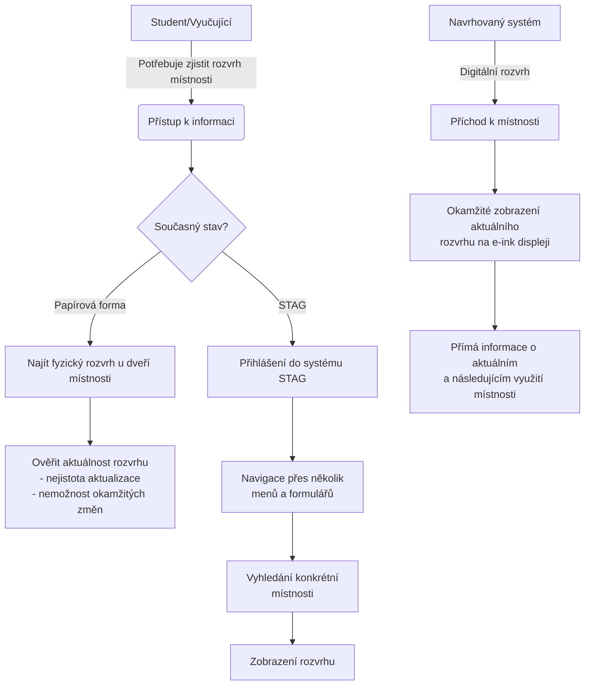

```mermaid
flowchart TD
    A[Student/Vyučující] -->|Potřebuje zjistit rozvrh místnosti| B(Přístup k informaci)
    B --> C{Současný stav?}
    C -->|Papírová forma| D[Najít fyzický rozvrh u dveří místnosti]
    D --> E[Ověřit aktuálnost rozvrhu\n- nejistota aktualizace\n- nemožnost okamžitých změn]
    C -->|STAG| F[Přihlášení do systému STAG]
    F --> G[Navigace přes několik\nmenů a formulářů]
    G --> H[Vyhledání konkrétní\nmístnosti]
    H --> I[Zobrazení rozvrhu]

    J[Navrhovaný systém] -->|Digitální rozvrh| K[Příchod k místnosti]
    K --> L[Okamžité zobrazení aktuálního\nrozvrhu na e-ink displeji]
    L --> M[Přímá informace o aktuálním\na následujícím využití místnosti]

```
