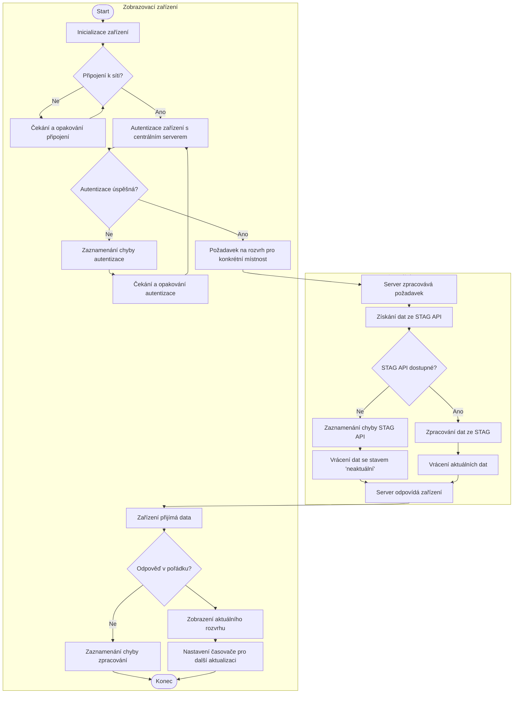

```mermaid
%%{init: {'flowchart': {'nodeSpacing': 20, 'rankSpacing': 10}} }%%
flowchart TD
    Start([Start]) --> DeviceInit[Inicializace zařízení]
    DeviceInit --> CheckConnection{Připojení k síti?}
    CheckConnection -->|Ne| RetryConnection[Čekání a opakování připojení]
    RetryConnection --> CheckConnection

    CheckConnection -->|Ano| AuthRequest[Autentizace zařízení s centrálním serverem]
    AuthRequest --> AuthCheck{Autentizace úspěšná?}
    AuthCheck -->|Ne| LogAuthError[Zaznamenání chyby autentizace]
    LogAuthError --> RetryAuth[Čekání a opakování autentizace]
    RetryAuth --> AuthRequest

    AuthCheck -->|Ano| RequestSchedule[Požadavek na rozvrh pro konkrétní místnost]

    RequestSchedule --> ServerProcess[Server zpracovává požadavek]
    ServerProcess --> FetchSTAG[Získání dat ze STAG API]

    FetchSTAG --> STAGAvailable{STAG API dostupné?}
    STAGAvailable -->|Ne| LogSTAGError[Zaznamenání chyby STAG API]
    LogSTAGError --> ReturnData[Vrácení dat se stavem 'neaktuální']

    STAGAvailable -->|Ano| ProcessData[Zpracování dat ze STAG]
    ProcessData --> ReturnFresh[Vrácení aktuálních dat]

    ReturnData --> RespondToDevice[Server odpovídá zařízení]
    ReturnFresh --> RespondToDevice

    RespondToDevice --> DeviceReceive[Zařízení přijímá data]
    DeviceReceive --> ResponseValid{Odpověď v pořádku?}

    ResponseValid -->|Ne| LogDeviceError[Zaznamenání chyby zpracování]
    LogDeviceError --> End([Konec])

    ResponseValid --> DisplaySchedule[Zobrazení aktuálního rozvrhu]
    DisplaySchedule --> SetUpdateTimer[Nastavení časovače pro další aktualizaci]
    SetUpdateTimer --> End

    subgraph "Centrální server"
        ServerProcess
        FetchSTAG
        STAGAvailable
        LogSTAGError
        ReturnData
        ProcessData
        ReturnFresh
        RespondToDevice
    end

    subgraph "Zobrazovací zařízení"
        Start
        DeviceInit
        CheckConnection
        RetryConnection
        AuthRequest
        AuthCheck
        LogAuthError
        RetryAuth
        RequestSchedule
        DeviceReceive
        ResponseValid
        LogDeviceError
        DisplaySchedule
        SetUpdateTimer
        End
    end
```
